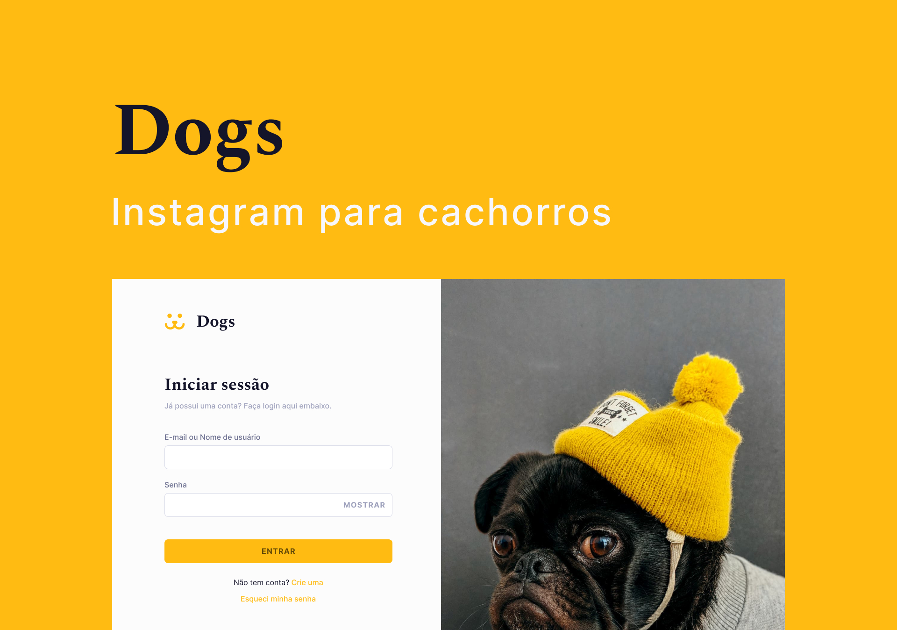

<h1 align="center">
  
</h1>

  
   
   
   
   

  <a href="#-sobre">Sobre</a>&nbsp;&nbsp;&nbsp;|&nbsp;&nbsp;&nbsp;
  <a href="#-tecnologias">Tecnologias</a>&nbsp;&nbsp;&nbsp;|&nbsp;&nbsp;&nbsp;
  <a href="#-como-executar">Como Executar</a>&nbsp;&nbsp;&nbsp;|&nbsp;&nbsp;&nbsp;
  <a href="#-todo">Todo</a>&nbsp;&nbsp;&nbsp;|&nbsp;&nbsp;&nbsp;
  <a href="https://www.figma.com/file/qZVVZzTWNF4SrAUqDqdiG2/Dogs?node-id=201%3A2">Figma</a>

## 🔖 Sobre

Dogs é um instagram para cachorros onde o usuário pode publicar uma foto, comentar, curtir e seguir outros usuários. Nessa aplicação utilizo, na parte web, [Next.js](https://nextjs.org/) com [TypeScript](https://www.typescriptlang.com), [Styled Components](https://styled-components.com) para os estilos e o [React Query](https://react-query.tanstack.com) para fazer a busca, cache e atualização dos dados do servidor.

## 📦 Tecnologias

- Frontend
  - [Next.js](https://nextjs.org/)
  - [TypeScript](https://www.typescriptlang.org)
  - [Styled Components](https://styled-components.com)
  - [React Query](https://react-query.tanstack.com)
- Backend
  - [Supabase](https://supabase.com/)

## 📝 License

[MIT License](./LICENSE)
